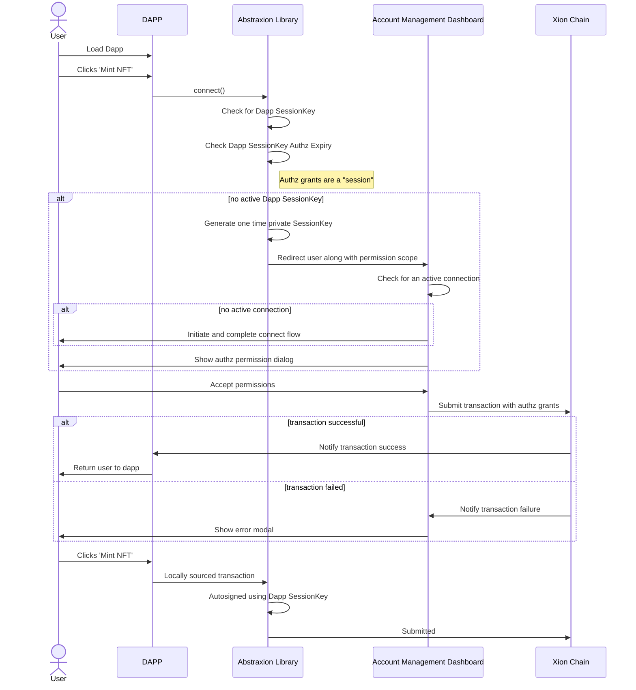

# Authz Design

```mermaid
sequenceDiagram
    Actor User
    participant DAPP
    participant AbstraxionLibrary as Abstraxion Library
    participant AccountManagementDashboard as Account Management Dashboard
    participant XionChain as Xion Chain
    User->>DAPP: Load Dapp
    User->>DAPP: Clicks 'Mint NFT'
    DAPP->>AbstraxionLibrary: connect()
    AbstraxionLibrary->>AbstraxionLibrary: Check for Dapp SessionKey 
    AbstraxionLibrary->>AbstraxionLibrary: Check Dapp SessionKey Authz Expiry
    Note right of AbstraxionLibrary: Authz grants are a "session"
    alt no active Dapp SessionKey
        AbstraxionLibrary->>AbstraxionLibrary: Generate one time private SessionKey
        AbstraxionLibrary->>AccountManagementDashboard: Redirect user along with permission scope 
        AccountManagementDashboard->>AccountManagementDashboard: Check for an active connection
        alt no active connection
            AccountManagementDashboard->>User: Initiate and complete connect flow
        end
        AccountManagementDashboard->>User: Show authz permission dialog
    end
    User->>AccountManagementDashboard: Accept permissions
    AccountManagementDashboard->>XionChain: Submit transaction with authz grants
    alt transaction successful
        XionChain->>DAPP: Notify transaction success
        DAPP->>User: Return user to dapp
    else transaction failed
        XionChain->>AccountManagementDashboard: Notify transaction failure
        AccountManagementDashboard->>User: Show error modal
    end
    User->>DAPP: Clicks 'Mint NFT'
    DAPP->>AbstraxionLibrary: Locally sourced transaction
    AbstraxionLibrary->>AbstraxionLibrary: Autosigned using Dapp SessionKey 
    AbstraxionLibrary->>XionChain: Submitted 
```
